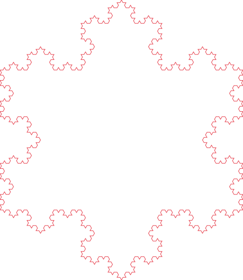
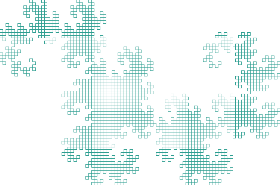
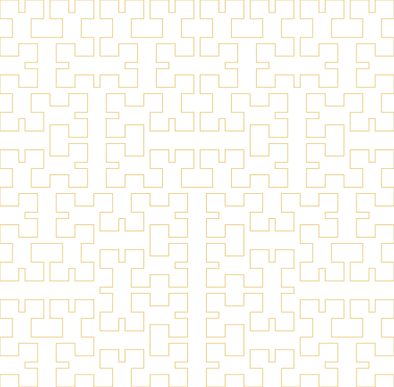
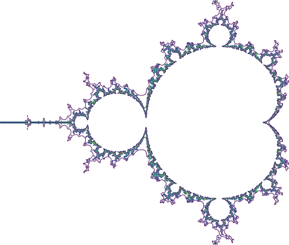
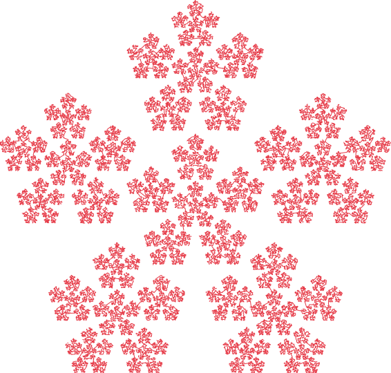
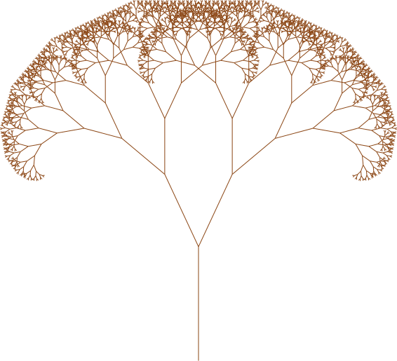
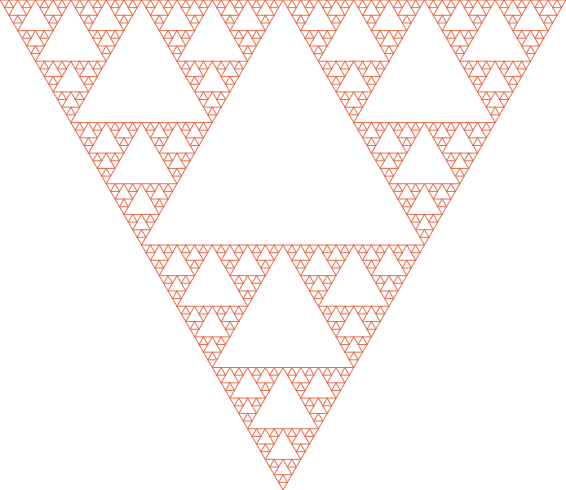
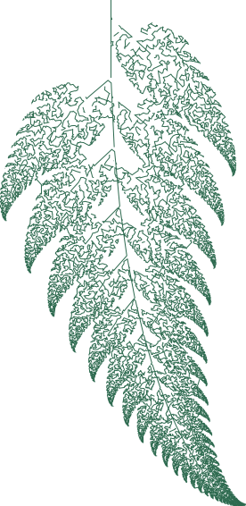

# vpype-fractal

A [vpype](https://github.com/abey79/vpype) plugin for generating fractal patterns as vector lines, designed for pen plotters and generative art.

21 commands across six engine types.

## Gallery

<table>
<tr>
<td align="center"><br><code>koch</code></td>
<td align="center"><br><code>dragon</code></td>
<td align="center"><br><code>hilbert</code></td>
</tr>
<tr>
<td align="center"><br><code>mandelbrot</code></td>
<td align="center"><br><code>julia</code></td>
<td align="center"><br><code>ifs --preset crystal</code></td>
</tr>
<tr>
<td align="center"><br><code>tree</code></td>
<td align="center"><br><code>sierpinski-triangle</code></td>
<td align="center"><br><code>fern</code></td>
</tr>
</table>

[Full gallery with reproduction commands](docs/GALLERY.md)

## Installation

```bash
pip install vpype-fractal
```

Or inject into an existing vpype installation:

```bash
pipx inject vpype vpype-fractal
```

For multi-pen color output on escape-time fractals, also install [vpype-penset](https://github.com/mreierson/vpype-penset):

```bash
pipx inject vpype vpype-penset
```

For development:

```bash
git clone https://github.com/mreierson/vpype-fractal.git
cd vpype-fractal
pip install -e ".[dev]"
```

## Quick Start

```bash
# Generate and display
vpype koch -d 4 -s 150mm show

# Write to SVG
vpype hilbert -d 6 -s 200mm write output.svg

# Mandelbrot with colored layers via vpype-penset
vpype penset viridis mandelbrot -d 100 -n 12 colorize write mandelbrot.svg

# Custom L-system
vpype lsystem --axiom "F--F--F" --rule "F=F+F--F+F" --angle 60 -d 4 show
```

## Commands

All commands accept `-s/--size` and integrate into the standard vpype pipeline. Most use `-d/--depth` to control recursion; IFS commands use `-p/--points` instead.

### L-System Fractals

Nine named presets, plus `lsystem` for custom rules.

| Command | Description |
|---------|-------------|
| `koch` | Koch snowflake |
| `sierpinski` | Sierpinski arrowhead curve |
| `dragon` | Dragon curve |
| `hilbert` | Hilbert space-filling curve |
| `levy` | Levy C curve |
| `gosper` | Gosper flowsnake |
| `peano` | Peano space-filling curve |
| `koch-island` | Quadratic Koch island |
| `minkowski` | Minkowski sausage |

Custom L-systems (supports `--heading` for initial turtle direction):

```bash
vpype lsystem --axiom "F--F--F" --rule "F=F+F--F+F" --angle 60 -d 4 show
vpype lsystem --axiom "A" --rule "A=B-A-B" --rule "B=A+B+A" --angle 60 -d 6 show
```

### Escape-Time Fractals

Each contour level is placed on a separate layer. Use [vpype-penset](https://github.com/mreierson/vpype-penset) for multi-pen color output:

```bash
vpype penset viridis mandelbrot -d 100 -n 12 colorize write mandelbrot.svg
vpype penset warm julia --cx -0.8 --cy 0.156 colorize write julia.svg
```

| Command | Description |
|---------|-------------|
| `mandelbrot` | Mandelbrot set contours |
| `julia` | Julia set contours (`--cx`, `--cy` set the constant) |

Additional options: `-r/--resolution`, `-n/--levels`, `--x-min/--x-max/--y-min/--y-max`.

### Geometric Fractals

| Command | Description |
|---------|-------------|
| `tree` | Fractal branching tree (`--branch-angle`, `--shrink`) |
| `carpet` | Sierpinski carpet |
| `sierpinski-triangle` | Sierpinski triangle by recursive subdivision |

### IFS Fractals

The `ifs` command generates fractals using the chaos game. The `fern` command is a shortcut for `ifs --preset fern`.

| Command | Description |
|---------|-------------|
| `ifs --preset fern` | Barnsley fern |
| `ifs --preset maple` | Maple leaf |
| `ifs --preset crystal` | Pentagonal crystal |
| `ifs --preset sierpinski-ifs` | Sierpinski triangle (IFS) |
| `fern` | Shortcut for `ifs --preset fern` |

Custom transforms:

```bash
vpype ifs --transform "0.5,0,0,0.5,0,0,1" \
          --transform "0.5,0,0,0.5,0.5,0,1" \
          --transform "0.5,0,0,0.5,0.25,0.433,1" show
```

Additional options: `-p/--points`, `--segment-length`, `--seed`.

### Strange Attractors

Point-cloud attractors sorted into plotter-friendly paths via nearest-neighbor traversal.

| Command | Description |
|---------|-------------|
| `clifford` | Clifford attractor (`--preset` or `-a`, `-b`, `-c`, `-d`) |
| `dejong` | De Jong attractor (`--preset` or `-a`, `-b`, `-c`, `-d`) |
| `lorenz` | Lorenz system, XZ projection (`--preset` or `--sigma`, `--rho`, `--beta`) |
| `attractor` | Generic command — access all presets across types |

```bash
vpype penset warm clifford --preset ribbon -p 5000 -n 6 colorize write clifford.svg
vpype attractor --preset wings -p 5000 -n 6 show
vpype penset viridis lorenz -n 10 colorize write lorenz.svg
```

Named presets: butterfly, ribbon, swirl (Clifford); orbit, tangle, wings (De Jong);
lorenz-classic, lorenz-tight (Lorenz).

The trajectory is drawn directly — overlapping strokes reveal the attractor structure.
Use `-p` to control density and `-n` to split into layers for color gradients.

Additional options: `-p/--points`, `-n/--layers`, `--seed`, `--dt` (lorenz only).

## Pipeline Recipes

```bash
# Optimize for plotting
vpype koch -d 5 -s 200mm linemerge linesort write output.svg

# Multiple fractals on separate layers
vpype koch -d 4 -s 80mm translate 10mm 10mm \
      hilbert -d 5 -s 80mm translate 100mm 10mm \
      write output.svg

# Mandelbrot with pen set colors
vpype penset viridis mandelbrot -d 200 -r 800 -n 15 \
      colorize linemerge linesort write -p a4 -c output.svg

# Multi-fractal composition with per-layer colors
vpype \
  tree -d 10 -s 70mm -l 1 color -l 1 "#8b4513" translate -l 1 5mm 5mm \
  koch -d 4 -s 70mm -l 2 color -l 2 "#e63946" translate -l 2 5mm 85mm \
  dragon -d 10 -s 70mm -l 3 color -l 3 "#2a9d8f" translate -l 3 85mm 5mm \
  sierpinski-triangle -d 5 -s 70mm -l 4 color -l 4 "#e9c46a" translate -l 4 85mm 85mm \
  write composite.svg
```

## Architecture

The plugin is built on six core engines:

- **L-system engine** -- expands axiom strings through iterative rule application
- **Turtle interpreter** -- converts L-system instruction strings into vector paths
- **Escape-time engine** -- computes iteration grids for Mandelbrot/Julia, with marching squares contour extraction
- **Geometric engine** -- recursive subdivision algorithms for tree, carpet, and Sierpinski triangle
- **IFS engine** -- runs the chaos game with configurable affine transforms
- **Attractor engine** -- iterates strange attractor systems (Clifford, De Jong, Lorenz)

## License

MIT
