# Gallery

Every fractal command in vpype-fractal, with the command used to generate each image.

## L-System Fractals

### Koch Snowflake


```bash
vpype koch -d 4 -s 150mm color "#e63946" write koch.svg
```

### Sierpinski Arrowhead

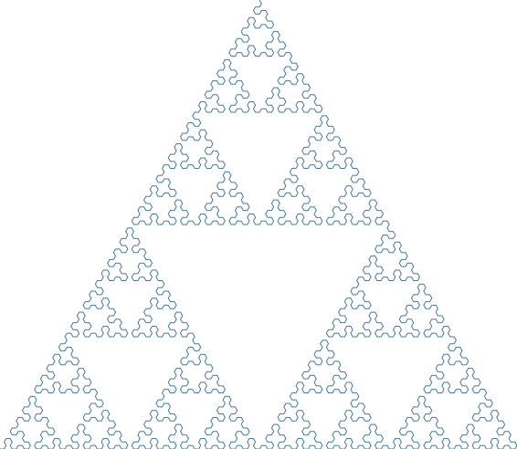

```bash
vpype sierpinski -d 7 -s 150mm color "#457b9d" write sierpinski.svg
```

### Dragon Curve


```bash
vpype dragon -d 12 -s 150mm color "#2a9d8f" write dragon.svg
```

### Hilbert Curve


```bash
vpype hilbert -d 5 -s 150mm color "#e9c46a" write hilbert.svg
```

### Levy C Curve

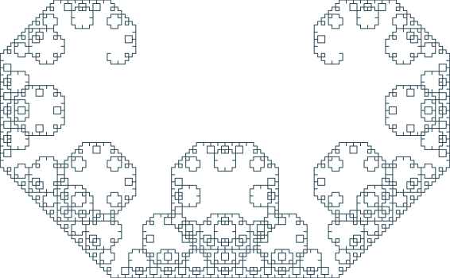

```bash
vpype levy -d 12 -s 150mm color "#264653" write levy.svg
```

### Gosper Flowsnake

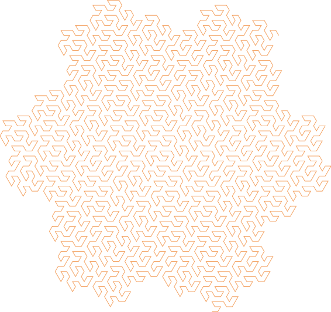

```bash
vpype gosper -d 4 -s 150mm color "#f4a261" write gosper.svg
```

### Peano Curve

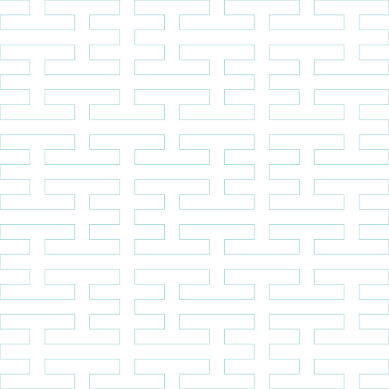

```bash
vpype peano -d 3 -s 150mm color "#a8dadc" write peano.svg
```

### Koch Island

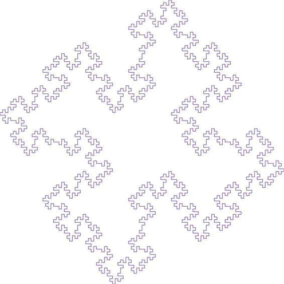

```bash
vpype koch-island -d 3 -s 150mm color "#6a4c93" write koch-island.svg
```

### Minkowski Sausage

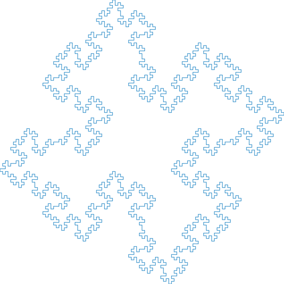

```bash
vpype minkowski -d 3 -s 150mm color "#1982c4" write minkowski.svg
```

## Escape-Time Fractals

### Mandelbrot Set


```bash
vpype penset viridis mandelbrot -d 200 -r 600 -n 15 -s 150mm colorize write mandelbrot.svg
```

### Julia Set


```bash
vpype penset warm julia --cx -0.8 --cy 0.156 -d 200 -r 600 -n 15 -s 150mm colorize write julia.svg
```

## Geometric Fractals

### Fractal Tree


```bash
vpype tree -d 12 --branch-angle 25 --shrink 0.7 -s 150mm color "#8b4513" write tree.svg
```

### Sierpinski Carpet

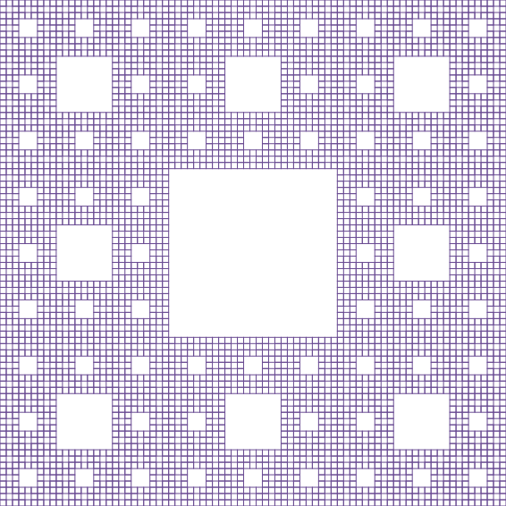

```bash
vpype carpet -d 4 -s 150mm color "#6a4c93" write carpet.svg
```

### Sierpinski Triangle


```bash
vpype sierpinski-triangle -d 6 -s 150mm color "#e76f51" write sierpinski-triangle.svg
```

## IFS Fractals

### Barnsley Fern


```bash
vpype fern -p 30000 --seed 42 -s 150mm color "#2d6a4f" write fern.svg
```

### Maple Leaf

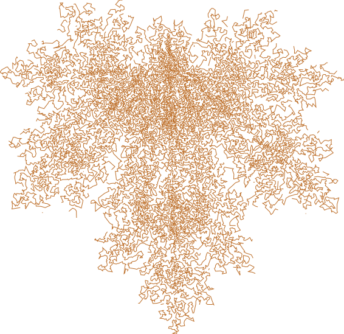

```bash
vpype ifs --preset maple -p 30000 --seed 42 -s 150mm color "#bc6c25" write maple.svg
```

### Crystal


```bash
vpype ifs --preset crystal -p 60000 --seed 42 -s 150mm color "#e63946" write crystal.svg
```

### Sierpinski (IFS)

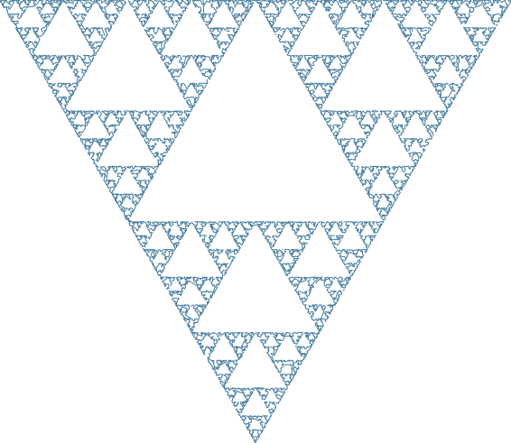

```bash
vpype ifs --preset sierpinski-ifs -p 20000 --seed 42 -s 150mm color "#457b9d" write sierpinski-ifs.svg
```

## Strange Attractors

### Clifford Attractor

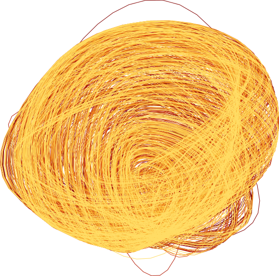

```bash
vpype penset warm clifford -p 3000 --seed 42 -n 6 -s 150mm colorize write clifford.svg
```

### De Jong Attractor

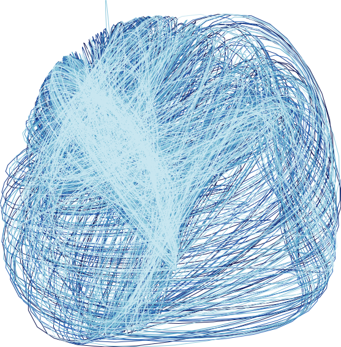

```bash
vpype penset cool dejong -p 3000 --seed 42 -n 6 -s 150mm colorize write dejong.svg
```

### Lorenz Attractor

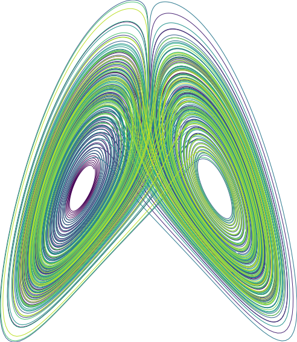

```bash
vpype penset viridis lorenz -p 50000 --seed 42 -n 10 -s 150mm colorize write lorenz.svg
```

## Composite

Multiple fractals combined in a single pipeline, each on its own layer with a distinct color:

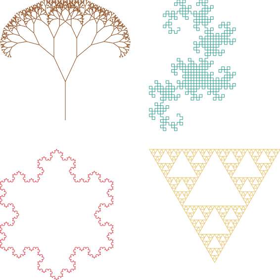

```bash
vpype \
  tree -d 10 -s 70mm -l 1 color -l 1 "#8b4513" translate -l 1 5mm 5mm \
  koch -d 4 -s 70mm -l 2 color -l 2 "#e63946" translate -l 2 5mm 85mm \
  dragon -d 10 -s 70mm -l 3 color -l 3 "#2a9d8f" translate -l 3 85mm 5mm \
  sierpinski-triangle -d 5 -s 70mm -l 4 color -l 4 "#e9c46a" translate -l 4 85mm 85mm \
  write composite.svg
```
