# Gallery

Every fractal command in vpype-fractal, with the command used to generate each image.

## Command Summary

| # | Command | Engine | Category | Description |
|---|---------|--------|----------|-------------|
| 1 | `koch` | L-system / turtle | Curve | Koch snowflake |
| 2 | `sierpinski` | L-system / turtle | Curve | Sierpinski arrowhead curve |
| 3 | `dragon` | L-system / turtle | Curve | Dragon curve |
| 4 | `hilbert` | L-system / turtle | Space-filling | Hilbert curve |
| 5 | `levy` | L-system / turtle | Curve | Levy C curve |
| 6 | `gosper` | L-system / turtle | Space-filling | Gosper flowsnake |
| 7 | `peano` | L-system / turtle | Space-filling | Peano curve |
| 8 | `koch-island` | L-system / turtle | Curve | Koch island |
| 9 | `minkowski` | L-system / turtle | Curve | Minkowski sausage |
| 10 | `lsystem` | L-system / turtle | Generic | User-defined L-system with presets |
| 11 | `tree` | Geometric / recursive | Botanical | Fractal tree |
| 12 | `carpet` | Geometric / recursive | Geometric | Sierpinski carpet |
| 13 | `sierpinski-triangle` | Geometric / recursive | Geometric | Sierpinski triangle (chaos game) |
| 14 | `fern` | IFS | Botanical | Barnsley fern |
| 15 | `ifs` | IFS | Generic | User-defined IFS with presets |
| 16 | `mandelbrot` | Escape-time + contour | Escape-time | Mandelbrot set contours |
| 17 | `julia` | Escape-time + contour | Escape-time | Julia set contours |
| 18 | `attractor` | Strange attractor | Attractor | Generic attractor with presets |
| 19 | `clifford` | Strange attractor | Attractor | Clifford attractor |
| 20 | `dejong` | Strange attractor | Attractor | De Jong attractor |
| 21 | `lorenz` | Strange attractor (RK4) | Attractor | Lorenz system (XZ projection) |

## L-System Fractals

### Koch Snowflake

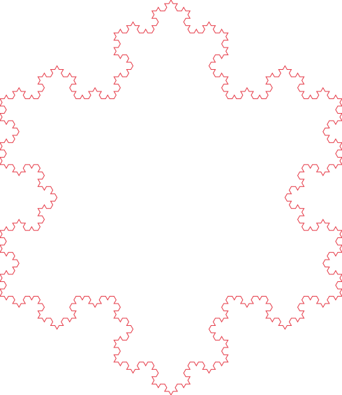

```bash
vpype koch -d 4 -s 150mm color "#e63946" write koch.svg
```

### Sierpinski Arrowhead

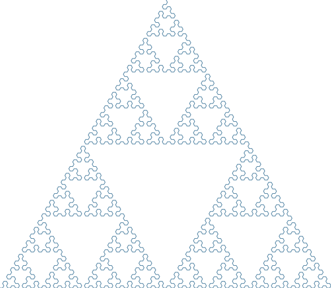

```bash
vpype sierpinski -d 7 -s 150mm color "#457b9d" write sierpinski.svg
```

### Dragon Curve

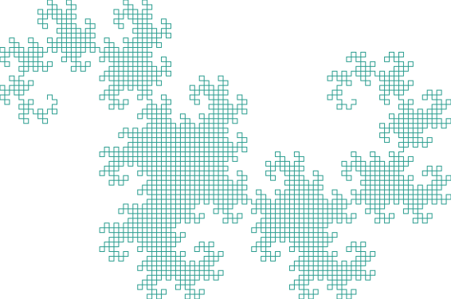

```bash
vpype dragon -d 12 -s 150mm color "#2a9d8f" write dragon.svg
```

### Hilbert Curve

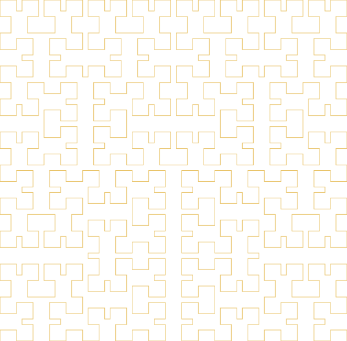

```bash
vpype hilbert -d 5 -s 150mm color "#e9c46a" write hilbert.svg
```

### Levy C Curve

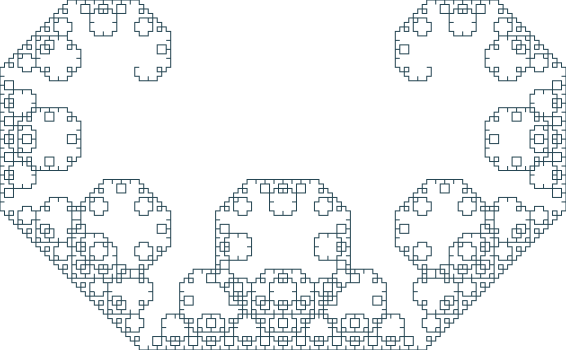

```bash
vpype levy -d 12 -s 150mm color "#264653" write levy.svg
```

### Gosper Flowsnake

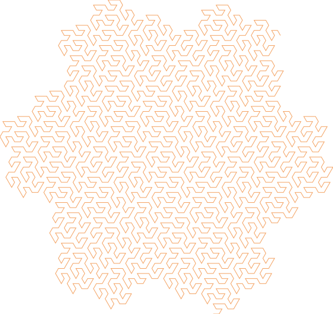

```bash
vpype gosper -d 4 -s 150mm color "#f4a261" write gosper.svg
```

### Peano Curve

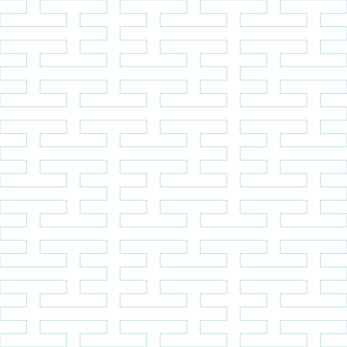

```bash
vpype peano -d 3 -s 150mm color "#a8dadc" write peano.svg
```

### Koch Island

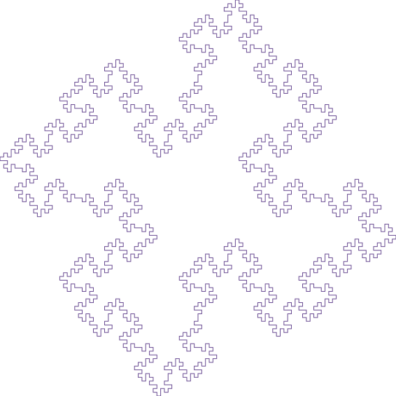

```bash
vpype koch-island -d 3 -s 150mm color "#6a4c93" write koch-island.svg
```

### Minkowski Sausage

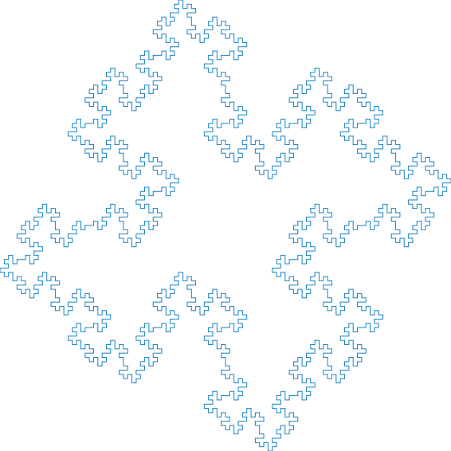

```bash
vpype minkowski -d 3 -s 150mm color "#1982c4" write minkowski.svg
```

## Escape-Time Fractals

### Mandelbrot Set


```bash
vpype penset viridis mandelbrot -d 200 -r 600 -n 15 -s 150mm colorize write mandelbrot.svg
```

### Julia Set


```bash
vpype penset warm julia --cx -0.8 --cy 0.156 -d 200 -r 600 -n 15 -s 150mm colorize write julia.svg
```

## Geometric Fractals

### Fractal Tree

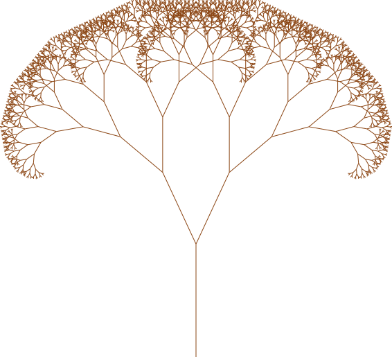

```bash
vpype tree -d 12 --branch-angle 25 --shrink 0.7 -s 150mm color "#8b4513" write tree.svg
```

### Sierpinski Carpet

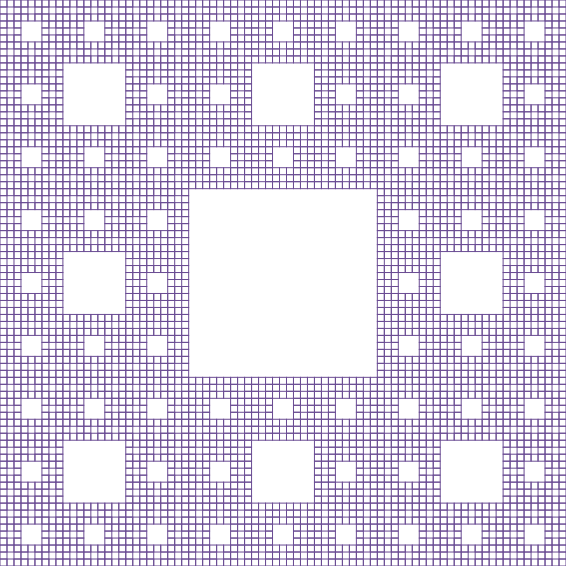

```bash
vpype carpet -d 4 -s 150mm color "#6a4c93" write carpet.svg
```

### Sierpinski Triangle

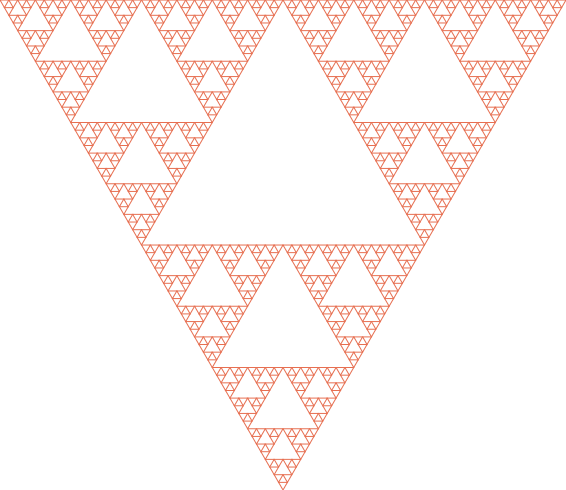

```bash
vpype sierpinski-triangle -d 6 -s 150mm color "#e76f51" write sierpinski-triangle.svg
```

## IFS Fractals

### Barnsley Fern

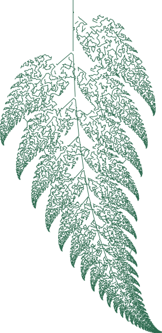

```bash
vpype fern -p 30000 --seed 42 -s 150mm color "#2d6a4f" write fern.svg
```

### Maple Leaf

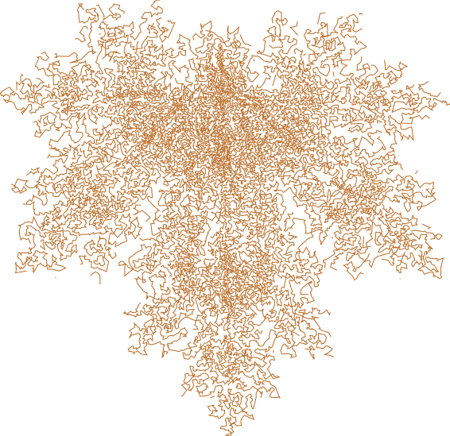

```bash
vpype ifs --preset maple -p 30000 --seed 42 -s 150mm color "#bc6c25" write maple.svg
```

### Crystal

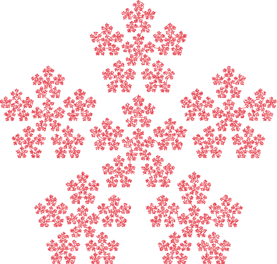

```bash
vpype ifs --preset crystal -p 60000 --seed 42 -s 150mm color "#e63946" write crystal.svg
```

### Sierpinski (IFS)

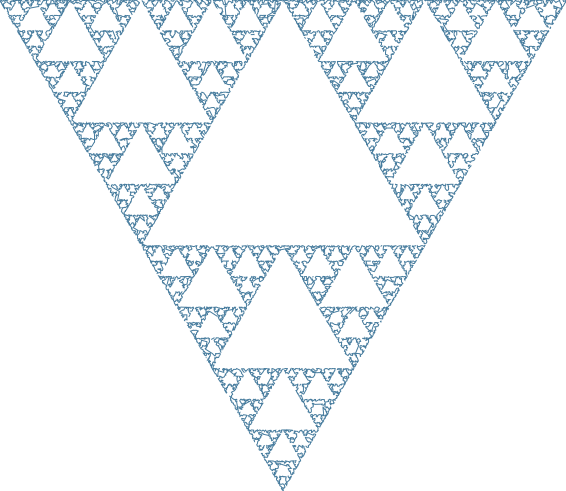

```bash
vpype ifs --preset sierpinski-ifs -p 20000 --seed 42 -s 150mm color "#457b9d" write sierpinski-ifs.svg
```

## Strange Attractors

### Clifford Attractor

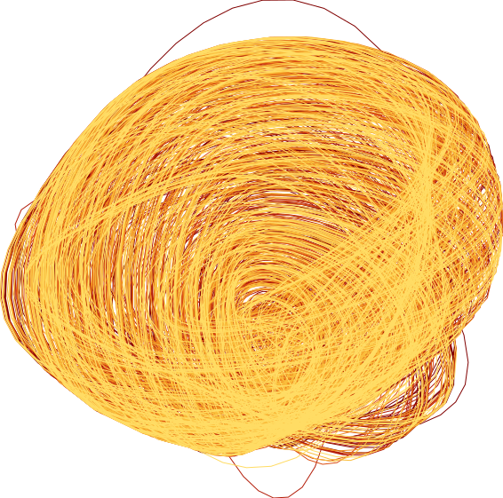

```bash
vpype penset warm clifford -p 3000 --seed 42 -n 6 -s 150mm colorize write clifford.svg
```

### De Jong Attractor

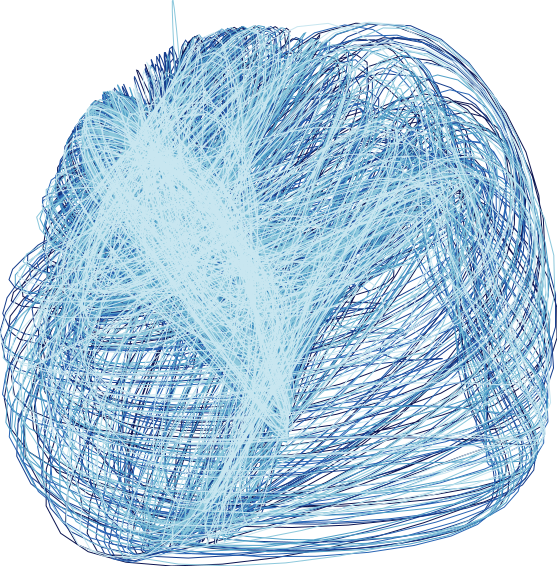

```bash
vpype penset cool dejong -p 3000 --seed 42 -n 6 -s 150mm colorize write dejong.svg
```

### Lorenz Attractor

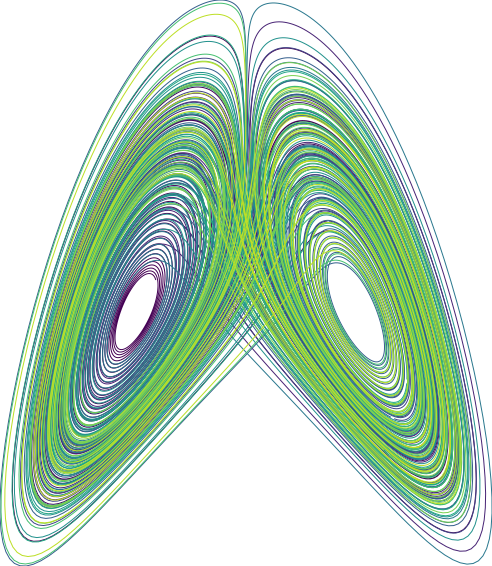

```bash
vpype penset viridis lorenz -p 50000 --seed 42 -n 10 -s 150mm colorize write lorenz.svg
```

## Botanical L-System Presets

The `lsystem` command includes botanical presets inspired by Prusinkiewicz & Lindenmayer.
These produce organic branching structures suitable for pen plotter art.

### Herb

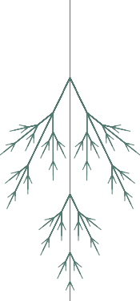

```bash
vpype lsystem --preset herb -d 5 -s 100mm color "#52796f" write herb.svg
```

### Kelp

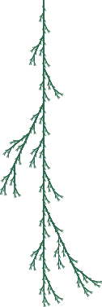

```bash
vpype lsystem --preset kelp -d 4 -s 100mm color "#2d6a4f" write kelp.svg
```

### Branching-Y

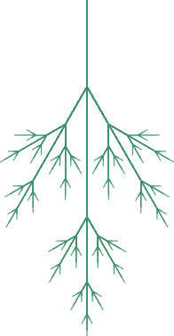

```bash
vpype lsystem --preset branching-y -d 5 -s 100mm color "#40916c" write branching-y.svg
```

### Moss

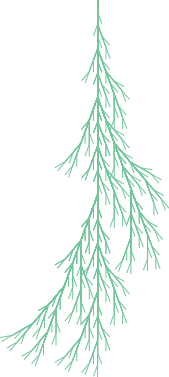

```bash
vpype lsystem --preset moss -d 4 -s 100mm color "#74c69d" write moss.svg
```

### Sapling

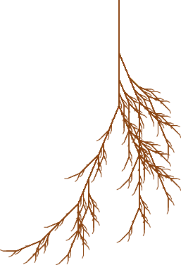

```bash
vpype lsystem --preset sapling -d 5 -s 100mm color "#8b4513" write sapling.svg
```

### Fern Frond

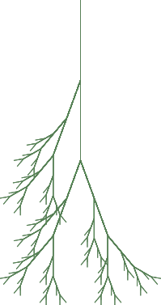

```bash
vpype lsystem --preset fern-frond -d 5 -s 100mm color "#588157" write fern-frond.svg
```

### Willow

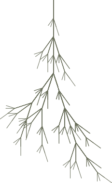

```bash
vpype lsystem --preset willow -d 3 -s 100mm color "#6b705c" write willow.svg
```

Also available: `tree-realistic`, `bush`, `flower`, `seaweed`, and `vine` (see `lsystem --help`).

## Composite

Multiple fractals combined in a single pipeline, each on its own layer with a distinct color:

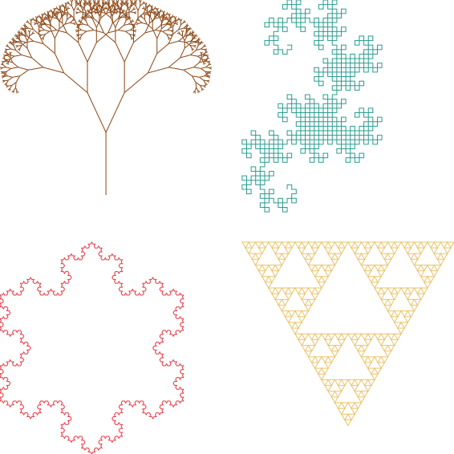

```bash
vpype \
  tree -d 10 -s 70mm -l 1 color -l 1 "#8b4513" translate -l 1 5mm 5mm \
  koch -d 4 -s 70mm -l 2 color -l 2 "#e63946" translate -l 2 5mm 85mm \
  dragon -d 10 -s 70mm -l 3 color -l 3 "#2a9d8f" translate -l 3 85mm 5mm \
  sierpinski-triangle -d 5 -s 70mm -l 4 color -l 4 "#e9c46a" translate -l 4 85mm 85mm \
  write composite.svg
```
